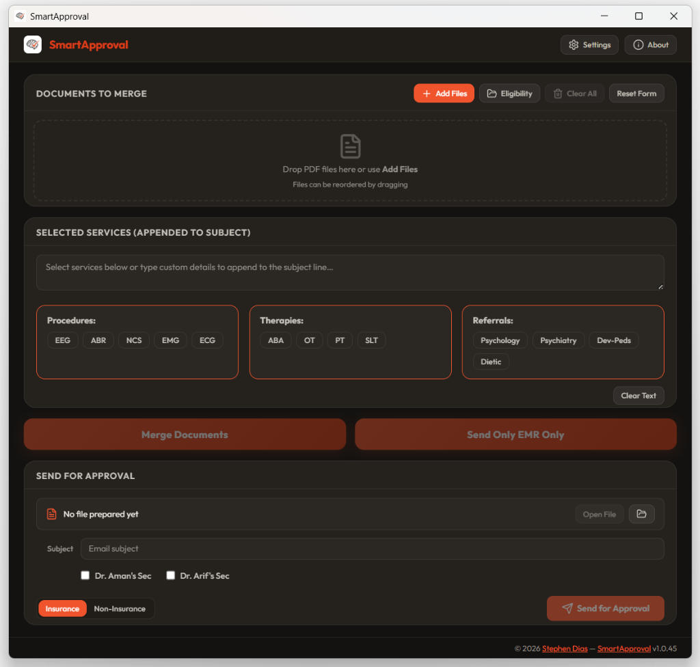
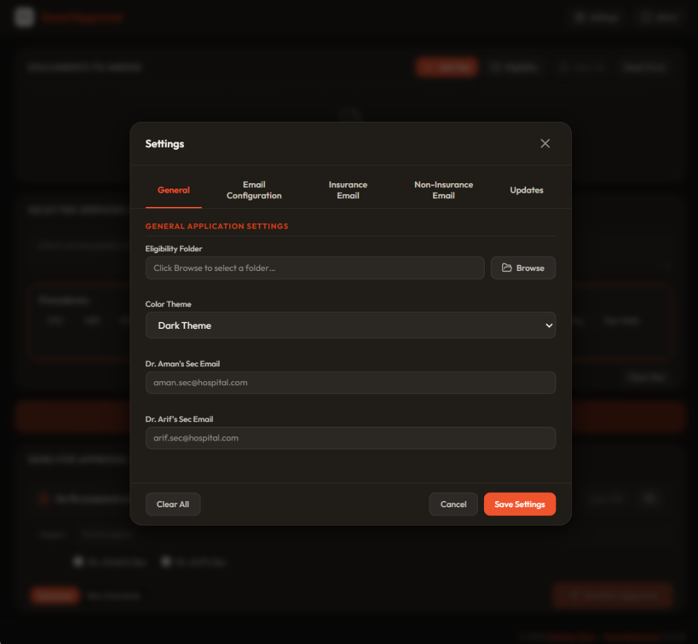
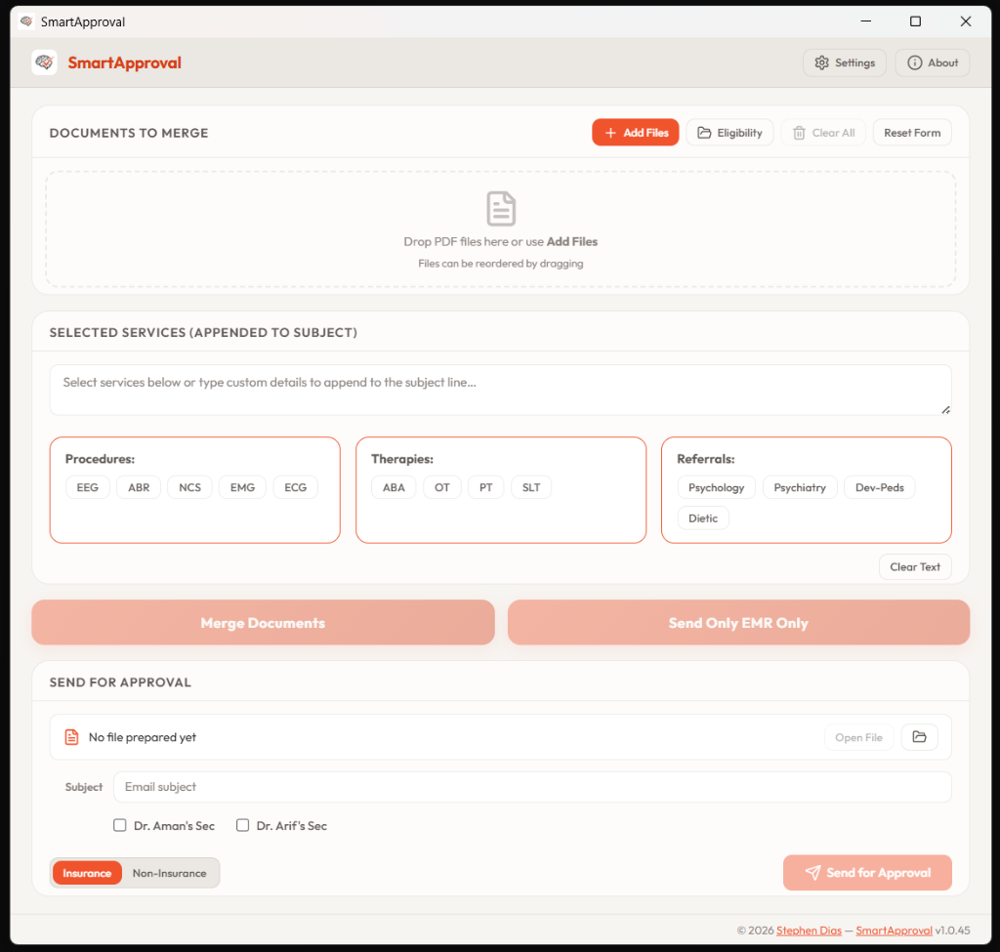
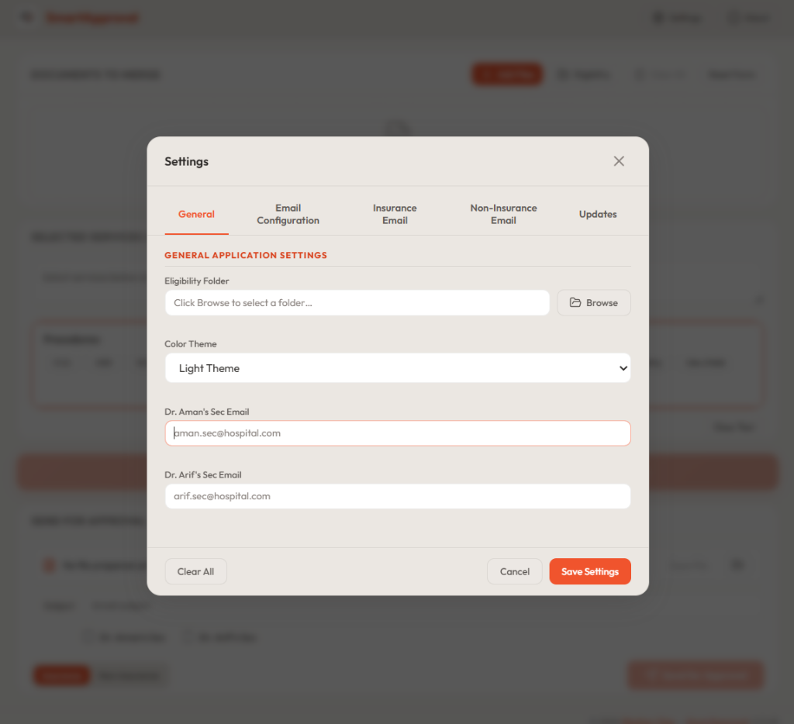

# Neuropedia — SmartApproval

A modern, high-performance desktop application built using **Tauri v2**, **React 19**, **TypeScript**, and **Rust (`lettre`)** to streamline clinical approval and documentation workflows.

## Key Features

* **PDF Merging**: Combine multiple PDF files (e.g., medical reports, insurance approvals, and clinical data) in a specific order.
* **Send Only EMR Only**: A fast-track option allowing the user to email a single medical report directly with automatically populated subject lines and services, bypassing the merge step.
* **Rich HTML Emailing**: Auto-generates and sends beautifully formatted HTML emails with bold patient names, MRN, and services using clean system fonts.
* **SMTP Integration**: Integrates directly with secure SMTP servers (e.g., Google Workspace/Gmail). Features dynamic TLS negotiation (Implicit TLS on port `465` and STARTTLS on port `587`).
* **BCC Secretary Routing**: Interactive checkboxes to automatically route CC/BCC emails to secretaries (Dr. Aman's Sec / Dr. Arif's Sec) with configurable email addresses in General Settings.
* **Grouped Service Quick-inserts**: Rounded card elements categorized by Procedures (EEG, ABR, NCS, EMG, ECG), Therapies (ABA, OT, PT, SLT), and Referrals (Psychology, Psychiatry, Dev-Peds, Dietic).
* **Automatic Background Updates**: A background check and native Rust-based download helper that installs updates cleanly without browser navigation.
* **Cross-Platform Packaging**: Automated build setup for both Windows (`.exe`/`.msi`) and macOS (`.dmg`) targets.

---

## Technical Stack

* **Frontend**: React 19, TypeScript, Vite, Outfit Font
* **Backend (Desktop Container)**: Rust (Tauri v2)
* **Email Client**: Lettre (Rust crate)
* **HTTP Downloader**: Reqwest (Rust crate) for WebView CORS-free background downloads
* **PDF Operations**: `pdf-lib` (Frontend merging and editing)

---

## Getting Started

### Prerequisites

1. Install **Node.js** (v18+ recommended).
2. Install **Rust** (via [rustup.rs](https://rustup.rs/)).

### Installation

Clone the repository and install dependencies:

```powershell
npm install
```

### Running Locally (Development Mode)

To start the Vite frontend server and launch the Tauri desktop application:

```powershell
npm run tauri dev
```

### Building for Production

To package the application into standalone native installers:

```powershell
# Build locally
npm run tauri build
```

*Note: Production releases are automated in the cloud via GitHub Actions triggered by pushing version tags (e.g. `v1.0.X`).*

---

## SMTP Configuration Notes

When configuring the email settings in the application:
1. **Port 587 (STARTTLS)**: Explicit TLS negotiation will be used.
2. **Port 465 (SSL/TLS)**: Implicit TLS negotiation will be used.
3. **Gmail/Workspace Accounts**: Make sure to use an **App Password** instead of your main account password if 2-Step Verification is active.

---

## Screenshots

### Dark Mode (Default)
| Main Interface | Settings Panel |
| --- | --- |
|  |  |

### Light Mode
| Main Interface | Settings Panel |
| --- | --- |
|  |  |

